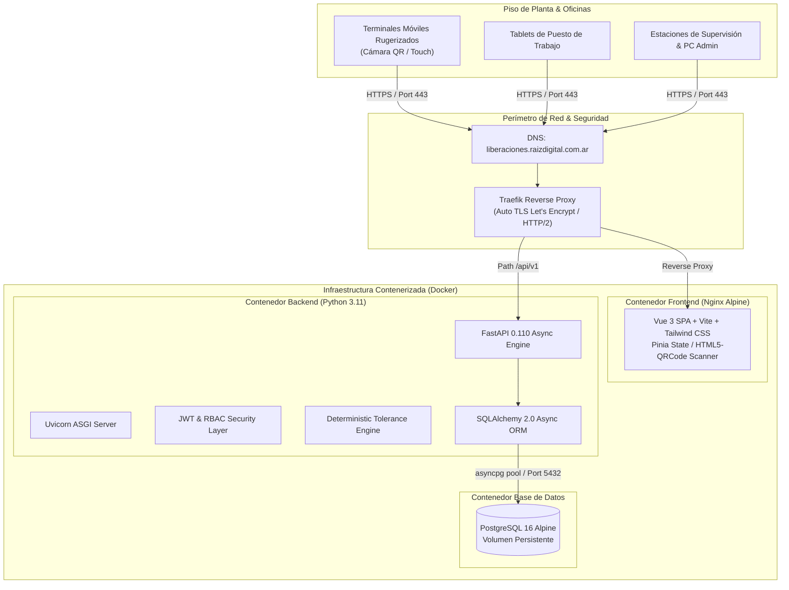
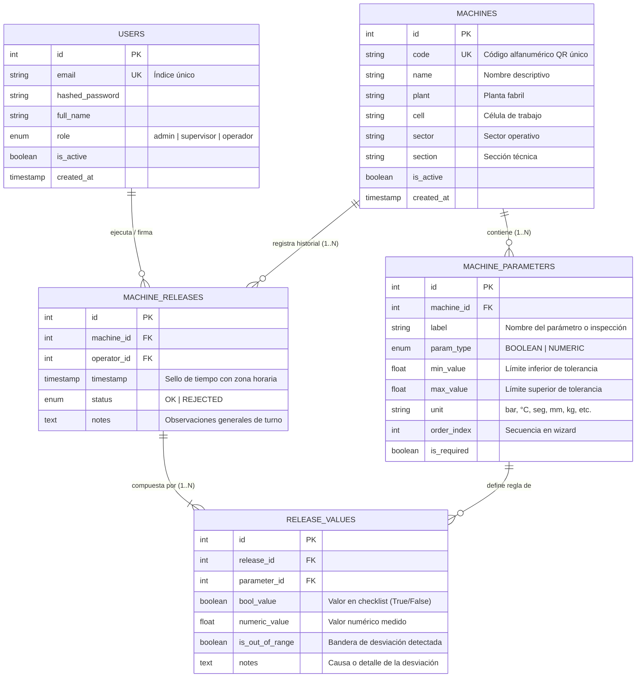

# WHITE PAPER: SISTEMA DE LIBERACIÓN DE PLANTA
## Plataforma Integral de Digitalización de Inspección Pre-Operativa, Aseguramiento de Calidad y Trazabilidad Industrial

---

**Documento:** White Paper Técnico y Operativo  
**Producto:** Sistema de Liberación de Planta  
**Entorno Oficial:** `https://liberaciones.raizdigital.com.ar`  
**Versión de Plataforma:** 1.0.0 (Producción)  
**Fecha:** Septiembre 2026  
**Clasificación:** Documento Técnico / Arquitectura & Negocio  
**Estado:** Vigente  

---

## 1. Resumen Ejecutivo (Executive Summary)

En los entornos de manufactura moderna y plantas industriales de alta cadencia, el aseguramiento de las condiciones de arranque de maquinaria —conocido comúnmente como **Liberación de Línea o Liberación de Primera Pieza**— representa uno de los puntos más críticos de control para mitigar fallas catastróficas, roturas de matrices, paradas no programadas de línea y generación masiva de producto no conforme (*scrap*).

Históricamente, este proceso se ha gestionado a través de planillas de papel ("checklists físicos"), planillas de cálculo desconectadas o validaciones verbales. Este paradigma analógico adolece de problemas estructurales: falta de validación de tolerancias en tiempo real, imposibilidad de trazabilidad inmediata, alteración retroactiva de datos, ilegibilidad y latencia crítica entre la detección de un desvío y la acción correctiva.

El **Sistema de Liberación de Planta** es una plataforma de software industrial concebida bajo principios de **Industria 4.0**, **Lean Manufacturing** y diseño **Poka-Yoke digital**. La plataforma digitaliza de punta a punta la verificación de parámetros pre-operativos de maquinaria mediante:
1. **Identificación óptica instantánea por Código QR:** Asociación inequívoca del operario con la máquina física en piso de planta.
2. **Asistente táctil guiado (Wizard Mobile-First):** Evaluación paso a paso (1 parámetro por vista) con botones sobredimensionados para entornos de trabajo exigentes.
3. **Motor determinístico de validación en tiempo real:** Evaluación instantánea de tolerancias numéricas y condiciones booleanas de seguridad, dictaminando automáticamente el estado de la máquina (**OK / Aprobada** vs. **REJECTED / Rechazada**).
4. **Registro transaccional inmutable y auditoría centralizada:** Almacenamiento atómico de cada lectura, operario firmante, marca de tiempo de turno y notas de desvío para auditorías de calidad (ISO 9001 / IATF 16949).
5. **Arquitectura Cloud-Native resiliente:** Backend asíncrono con FastAPI y PostgreSQL, frontend reactivo con Vue 3 y despliegue automatizado mediante contenedores Docker con balanceo y cifrado TLS administrado por Traefik.

---

## 2. Definición del Problema y Justificación de Negocio

### 2.1 El Costo del Control Analógico en Planta

En una línea de producción típica (estampado, inyección de polímeros, centros de mecanizado CNC o líneas de ensamblaje), operar una máquina fuera de sus especificaciones nominales genera pérdidas exponenciales:

* **Paradas no programadas:** Una presión de sujeción hidráulica incorrecta o una temperatura de fusión desfasada provocan atascamientos, rotura de moldes o paradas que paralizan toda la célula productiva.
* **Scrap masivo y reprocesos:** Si un lote comienza a fabricarse con una máquina descalibrada, cientos o miles de piezas quedan defectuosas antes de que control de calidad intermedie en la línea.
* **Vulnerabilidad en Seguridad Ocupacional:** Omitir la verificación de paradas de emergencia, barreras infrarrojas o niveles de lubricación expone a los operarios a accidentes graves y a la empresa a contingencias legales.
* **Opacidad y "Efecto Papel Mojado":** Las planillas impresas se completan al final del turno por inercia ("tildar por tildar"), se extravían, se deterioran con grasa/aceite o carecen de correlación temporal verídica con el inicio de la orden de producción.

```
PARADIGMA TRADICIONAL (ANALÓGICO):
[Papel / Checklist Manual] ──> [Llenado tardío/incompleto] ──> [Falta de validación] ──> [Riesgo de Falla / Scrap]
                                                                                              │
PARADIGMA "LIBERACIÓN DE PLANTA" (DIGITAL & POKA-YOKE):                                       ▼
[Código QR en Máquina] ──> [Escaneo en Piso] ──> [Wizard 1-a-1] ──> [Validación Automática] ──> [Decisión Binaria Inmediata OK/RECHAZO]
```

### 2.2 Requerimientos de Cumplimiento Normativo (ISO 9001 / IATF 16949)

Las normas internacionales de gestión de calidad exigen evidencia objetiva del control de equipos de proceso y de seguimiento de variables críticas. El Sistema de Liberación de Planta resuelve los requisitos de:
* **Trazabilidad de la persona y el tiempo:** Identificación precisa del operador que ejecutó la verificación con sello temporal (*timestamp*) inmutable.
* **Control de variables críticas:** Garantía de que ninguna máquina entre en régimen de producción si uno solo de sus parámetros mandatorios no cumple la tolerancia establecida.
* **Registro de anomalías:** Captura de causas y observaciones específicas por cada parámetro desviado, facilitando el análisis de causa raíz (*5 Por Qués*, *Ishikawa*).

---

## 3. Arquitectura del Sistema

La solución adopta una arquitectura desacoplada Cliente-Servidor (*Headless API-first*), contenerizada y orientada a microservicios bajo un esquema Cloud-Native.

### 3.1 Diagrama de Arquitectura Global



### 3.2 Pila Tecnológica (Tech Stack)

| Capa / Componente | Tecnología | Justificación Técnica |
| :--- | :--- | :--- |
| **Frontend Framework** | Vue.js 3.4 (`<script setup>` / Composition API) | Reactividad ligera, alto rendimiento en dispositivos móviles industriales de bajos recursos, arquitectura modular y tipado predictivo. |
| **Build & Bundler** | Vite 5.2 | Hot Module Replacement (HMR) ultrarrápido, generación de bundles estáticos optimizados con compresión y *code-splitting*. |
| **Estilos & UI** | Tailwind CSS 3.4 | Sistema de diseño táctil coherente con paleta industrial de alto contraste (*Dark Slate / Sky / Emerald / Crimson*), botones táctiles de 48px+ (*touch targets*) y estados de alerta visual activa. |
| **Gestión de Estado** | Pinia 2.1 | Store centralizado y tipado para sesión de usuario, catálogo de máquinas y estado transitorio de la liberación en curso. |
| **Lector Óptico QR** | HTML5-QRCode 2.3 | Acceso directo por API de cámara web/móvil nativa sin requerir instalación de aplicativos nativos (cero fricción de despliegue). |
| **Backend Framework** | FastAPI 0.110 (Python 3.11+) | Rendimiento asíncrono comparable a NodeJS y Go, validación estricta de esquemas en tiempo de ejecución con Pydantic v2 y auto-documentación interactiva OpenAPI (Swagger). |
| **Motor Asíncrono BD** | SQLAlchemy 2.0 + asyncpg | Mapeo objeto-relacional asíncrono de alto rendimiento, evitando bloqueos de I/O en concurrencia masiva de piso de planta. |
| **Motor de Base de Datos** | PostgreSQL 16 Alpine | RDBMS ACID de confiabilidad industrial, soporte de tipos nativos, índices optimizados y restricciones de integridad referencial con borrado en cascada. |
| **Seguridad & Tokens** | python-jose + bcrypt | Autenticación basada en JSON Web Tokens (JWT) con algoritmo criptográfico HS256 y hashing de contraseñas con salado computacionalmente costoso. |
| **Enrutamiento Perimetral** | Traefik v2/v3 | Reverse proxy nativo para Docker con auto-descubrimiento de contenedores y emisión/renovación automática de certificados SSL con Let's Encrypt. |
| **CI/CD & Registro** | GitHub Actions + GHCR | Integración continua, construcción automatizada de imágenes multi-stage y despliegue sin caída de servicio (*zero-downtime pull & recreate*). |

---

## 4. Modelo de Dominio y Datos

La estructura relacional del sistema modela con fidelidad la jerarquía espacial de una planta productiva y la dinámica de liberación de equipos.

### 4.1 Diagrama Entidad-Relación (ERD)



### 4.2 Jerarquía Espacial de Planta

Para permitir una segmentación intuitiva de los activos, cada equipo cuenta con cuatro dimensiones de localización física:
* **Planta:** Centro productivo global (ej: *Planta Central*, *Planta Norte*).
* **Sector:** Área de manufactura (ej: *Mecanizado*, *Inyección*, *Estampado*).
* **Célula:** Célula productiva o línea modular (ej: *Célula Envasado A*, *Célula Soldadura 3*).
* **Sección:** Subdivisión funcional o puesto de trabajo directo (ej: *Mecanizado de Precisión*).

Esta parametrización permite a los supervisores filtrar auditorías y reportes analíticos con precisión milimétrica.

---

## 5. El Algoritmo Determinístico de Liberación

El corazón de la solución reside en su **Motor de Evaluación de Tolerancias** implementado en la capa de servicios del backend (`backend/app/api/v1/releases.py`), el cual opera de manera complementaria con el cálculo en vivo en el frontend para retroalimentación instantánea al operario.

### 5.1 Reglas de Evaluación de Parámetros

El sistema clasifica las variables en dos familias operativas:

1. **Parámetros Booleanos (`ParamType.BOOLEAN`):**
   * Empleados para inspecciones visuales, resguardos mecánicos, ausencia de fugas y barreras de seguridad.
   * Regla de conformidad:
     $$\text{Conforme} \iff \text{bool\_value} = \text{True}$$
     $$\text{is\_out\_of\_range} = \text{True} \iff \text{bool\_value} \in \{\text{False}, \text{None}\}$$

2. **Parámetros Numéricos Continuos (`ParamType.NUMERIC`):**
   * Empleados para magnitudes físicas (presión, temperatura, ciclos, dimensiones, espesores).
   * Cuentan con un intervalo de tolerancia cerrado o semi-abierto $[\text{min\_value}, \text{max\_value}]$.
   * Regla de conformidad:
     $$\text{is\_out\_of\_range} = \text{True} \iff (\text{numeric\_value} < \text{min\_value}) \lor (\text{numeric\_value} > \text{max\_value}) \lor (\text{numeric\_value} = \text{null})$$

### 5.2 Determinación Atómica del Estado Global

El estado de la liberación se rige por un principio de **cero tolerancia al error**:

$$\text{Status} = \begin{cases} \text{OK}, & \text{si } \forall i \in \{1, \dots, n\}: \text{is\_out\_of\_range}_i = \text{False} \\ \text{REJECTED}, & \text{si } \exists i \in \{1, \dots, n\}: \text{is\_out\_of\_range}_i = \text{True} \end{cases}$$

#### Garantía Transaccional ACID:
Toda la operación (creación de la cabecera `MachineRelease` y la totalidad de los registros `ReleaseValue`) se ejecuta dentro de un único bloque transaccional en la base de datos:
* Si se interrumpe la conexión de red durante el envío, la base de datos ejecuta un `ROLLBACK` automático, impidiendo la existencia de liberaciones incompletas o registros huérfanos.
* No es posible registrar un dictamen sin haber proporcionado respuestas a todos los parámetros marcados como mandatorios (`is_required = True`).

---

## 6. Ergonomía en Piso de Planta (UX Industrial y Diseño Táctil)

Las aplicaciones para entornos de manufactura deben diseñarse bajo premisas totalmente diferentes a las del software corporativo tradicional. En el piso de fábrica, los operarios manipulan dispositivos con guantes, bajo iluminación variable, ruido industrial y con premura de tiempo.

### 6.1 Principios de Usabilidad Implementados

1. **Flujo Wizard de 1 Parámetro por Pantalla:**  
   En lugar de un formulario denso y abrumador de 20 preguntas con scroll infinito, la aplicación implementa un asistente secuencial (*wizard*). El operario se concentra en una única variable a la vez, reduciendo la fatiga cognitiva y previniendo la omisión accidental de inspecciones.
2. **Targets Táctiles Sobredimensionados:**  
   Los botones de confirmación (*✓ OK* / *✕ NOk*) poseen alturas generosas (56px) con paletas contrastantes: Verde Esmeralda (`#059669`) para estados conformes y Rojo Carmesí (`#dc2626`) para desvíos.
3. **Barra de Estado Global en Tiempo Real:**  
   En la cabecera superior del asistente, una placa inteligente informa en tiempo real si el acumulado de las mediciones previas mantiene la liberación como **"Parámetros Ok (APROBABLE)"** o si ya ha conmutado a **"Parámetros No Ok (RECHAZADO)"**.
4. **Modal Contextual de Desviación:**  
   Cuando un parámetro numérico o booleano cae fuera de tolerancia, la interfaz activa automáticamente una alerta visual pulsante y ofrece un acceso directo para asentar una observación detallada del motivo de la falla sin abandonar el flujo de trabajo.
5. **Modal de Confirmación Inequívoco:**  
   Al completar el último paso, la aplicación despliega una ventana de confirmación con íconos vectoriales SVG de alto contraste (tilde verde o cruz roja de gran formato) y la hora exacta de registro para dar certeza visual al operario.

---

## 7. Módulo Administrativo y Parametrización Dinámica

Una de las mayores fortalezas arquitectónicas de la plataforma es que **no requiere intervención de desarrolladores de software para dar de alta nuevas máquinas o modificar parámetros de control**.

### 7.1 Gestión de Equipos Sin Código (No-Code Asset Management)
Desde el panel de administración (`/admin/machines`), exclusivo para Administradores, los responsables de planta pueden:
* Dar de alta, editar y deshabilitar máquinas en segundos.
* Asignar la jerarquía de Planta, Célula, Sector y Sección.
* Agregar, reordenar y configurar los parámetros dinámicos de cada máquina, definiendo etiquetas, tipo de dato, límites numéricos y unidades físicas.
* Definir si el parámetro es de cumplimiento obligatorio.

### 7.2 Emisión e Impresión de Códigos QR
El sistema incorpora un generador vectorial de códigos QR en el módulo administrativo. Al hacer clic en el botón **QR** de cualquier equipo en el panel administrativo, el sistema genera el código exacto y permite su impresión directa con formato de etiqueta industrial lista para ser pegada en el chasis de la máquina en planta.

---

## 8. Seguridad, Autenticación y Control de Acceso (RBAC)

La plataforma aplica un modelo de **Defensa en Profundidad** y estricta segregación de funciones operativas:

### 8.1 Matriz de Control de Acceso Basado en Roles (RBAC)

| Módulo / Funcionalidad | Operador | Supervisor | Administrador |
| :--- | :---: | :---: | :---: |
| **Inicio de Sesión y Perfil** | ✅ | ✅ | ✅ |
| **Escaneo QR e Identificación de Máquinas** | ✅ | ❌ | ✅ |
| **Módulo de Carga y Firma de Liberación** | ✅ | ❌ | ✅ |
| **Consulta del Historial Operativo y Auditoría** | ❌ | ✅ | ✅ |
| **Panel de Equipos / Parametrizador (`/admin/machines`)** | ❌ | ❌ | ✅ (Exclusivo) |
| **Alta y Edición de Equipos** | ❌ | ❌ | ✅ (Exclusivo) |
| **Configuración de Parámetros y Tolerancias** | ❌ | ❌ | ✅ (Exclusivo) |
| **Generación e Impresión de Etiquetas QR** | ❌ | ❌ | ✅ (Exclusivo) |
| **Baja Lógica de Equipos** | ❌ | ❌ | ✅ (Exclusivo) |

### 8.2 Mecanismos de Seguridad Técnica
* **Tokens Criptográficos JWT:** Los tokens de portador (*Bearer Tokens*) se emiten tras la autenticación exitosa contra el endpoint `/api/v1/auth/token`. Cuentan con una validez configurada de 480 minutos (8 horas), calibrada exactamente con la duración estándar de un turno productivo para no interrumpir la operativa diaria.
* **Seguridad de Contraseñas:** Ninguna contraseña se almacena en texto claro. Se utiliza el algoritmo `bcrypt` con generación de sal aleatoria (*salted hashing*).
* **Protección de Rutas (Navigation Guards):** El frontend intercepta cada transición de ruta en el cliente verificando la presencia del token y el rol de usuario, redirigiendo automáticamente accesos indebidos hacia la vista de escaneo o login.
* **Validación en Backend:** De forma redundante a la UI, la API protege cada endpoint administrativo con la inyección de dependencias `require_role(UserRole.ADMIN)`.

---

## 9. Estrategia DevOps, Despliegue e Infraestructura

El sistema está concebido para ser operado bajo esquemas de alta disponibilidad y mantenimiento automatizado.

### 9.1 Canal de Despliegue Continuo (CI/CD Pipeline)

```
[Repositorio Git]
       │
       ▼ (git push main)
[GitHub Actions Workflow (deploy.yml)]
       │
       ├──> 1. Compilación Backend Dockerfile
       ├──> 2. Compilación Frontend Multi-stage (Node Build -> Nginx Production)
       ├──> 3. Publicación de imágenes en GitHub Container Registry (ghcr.io)
       │
       ▼ (SSH Deployment a VPS en Producción)
[Servidor de Producción]
       │
       ├──> docker login ghcr.io
       ├──> git pull
       ├──> docker compose -f docker-compose.prod.yml pull
       ├──> docker compose -f docker-compose.prod.yml up -d
       └──> docker image prune -f (Limpieza de disco)
```

### 9.2 Infraestructura Perimetral con Traefik
En el entorno de producción (`liberaciones.raizdigital.com.ar`), el tráfico entrante es gestionado por un contenedor **Traefik** conectado a la red externa `traefik-network`. Traefik:
* Resuelve el handshake TLS de forma transparente.
* Renueva automáticamente los certificados Let's Encrypt antes de su vencimiento.
* Realiza enrutamiento inteligente enviando el tráfico de la SPA estática hacia Nginx y las peticiones bajo `/api/v1` directamente al contenedor de FastAPI.

---

## 10. Impacto Operativo y Retorno de la Inversión (ROI)

La adopción del Sistema de Liberación de Planta produce mejoras cuantificables en los principales indicadores de manufactura (KPIs):

| Indicador Industrial | Situación Previa (Analógica) | Con Sistema de Liberación | Impacto Cuantitativo |
| :--- | :--- | :--- | :--- |
| **Tiempo de Auditoría y Verificación** | 15 a 20 min (búsqueda de planilla, llenado a mano) | 2 a 3 min (escaneo QR + wizard táctil) | **Reducción de hasta un 80% en tiempo de arranque** |
| **Scrap por Parámetro Descalibrado** | Detectado tras 50-200 piezas fabricadas | Cero (máquina bloqueada en RECHAZADO) | **Reducción del 95% de scrap inicial de lote** |
| **Disponibilidad para Auditorías ISO** | 2 a 3 días recopilando y ordenando biblioratos | Inmediata (consulta online en segundos) | **Tiempo de respuesta: tiempo real** |
| **Trazabilidad y No Repudio** | Firmas ilegibles, hojas dañadas con grasa | Registro digital con usuario y timestamp | **100% de integridad y trazabilidad** |

---

## 11. Hoja de Ruta Tecnológica (Roadmap)

La arquitectura modular de la plataforma sienta las bases para futuras fases evolutivas:

* **Fase 1.1 — Notificaciones en Tiempo Real (Alerting Automatizado):**  
  Integración de Webhooks con Telegram, Slack o WhatsApp Business API para notificar de forma instantánea a Supervisores y Líderes de Mantenimiento cuando una máquina es marcada como `REJECTED`.
* **Fase 1.2 — Modo PWA Offline-First:**  
  Implementación de Service Workers y almacenamiento local en `IndexedDB` para permitir la captura de parámetros en zonas de planta con sombra de señal Wi-Fi o interferencias electromagnéticas, sincronizando las transacciones automáticamente al recuperar la conectividad.
* **Fase 2.0 — Control Estadístico de Procesos (SPC / Cartas de Control):**  
  Generación automática de gráficos de tendencia sobre parámetros continuos para predecir cuándo una máquina comenzará a descalibrarse antes de violar la tolerancia crítica (mantenimiento predictivo).
* **Fase 2.1 — Conectividad IoT / PLC (OPC-UA & MQTT):**  
  Conexión directa con autómata programable (PLC) para precargar lecturas de sensores de la máquina (temperaturas, presiones) directamente en el formulario del operador, eliminando la transcripción manual.

---

## 12. Conclusión

El **Sistema de Liberación de Planta** consolida la transición de la gestión de calidad analógica hacia una infraestructura industrial digital, confiable y auditable. Al combinar una interfaz táctil ultra-simplificada con un motor determinístico y una arquitectura Cloud-Native de vanguardia, la plataforma elimina el error humano en los arranques de producción, salvaguarda la integridad de los activos fabriles y asegura la excelencia operativa que exige la manufactura de clase mundial.

---

*Desarrollado y mantenido por el equipo de ingeniería de Raíz Digital.*  
*Para soporte técnico, consultas de arquitectura o solicitudes de integración: soporte@raizdigital.com.ar*
